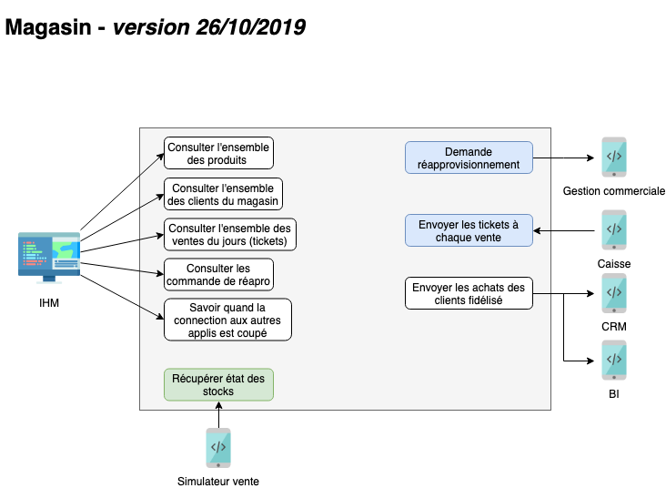
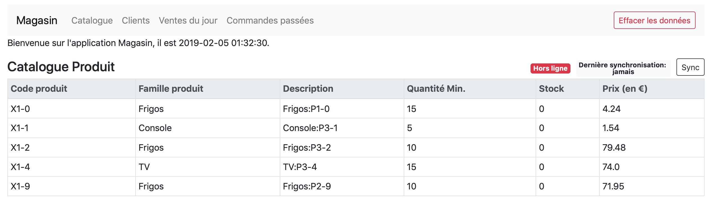

[Sommaire SI](https://ursi-2020.github.io/Documentation/)

# Sections

* [API](api.md)
* [Flux](flux.md)

# Rôle de l'application

Le rôle de `Magasin` est de s'occuper de toutes les activités spécifiques à un magasin, comme la gestion d'un stock magasin
et son réapprovisionnement, les promotions locales, la mise à disposition de ressources pour le bon fonctionnement de `Caisse`.

# Use Case

 *[Anciennes versions des Uses Cases](use-case.md)*

# Utilisation de l'application

La page d'accueil de l'application Magasin présente le référentiel PRODUIT. Depuis la barre de navigation nous avons accès au référetiel CLIENT, aux Ventes réalisé en magasin et les commandes passées.

Au démarrage du serveur, 2 tâches sont lancées et ont pour but de mettre à jour automatiquement quotidiennement ces référentiels depuis les applications CATALOGUE et CRM.

Dans l'application, il est possible de:
- supprimer toutes les données de la base de donnée
- synchroniser manuellement le référentiel PRODUIT depuis CATALOGUE
- synchroniser manuellement le référentiel CLIENT depuis CRM
- synchroniser manuellement les ventes du jour depuis la CAISSE
- synchroniser manuellement les commandes depuis la GESTION COMMERCIALE
- voir si les applications CATALOGUE,CRM, CAISSE, GESTION COMMERCIALE sont hors ligne/en ligne
- voir la dernière heure de synchronisation de chaque application
